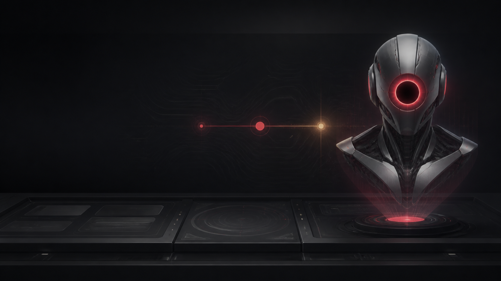
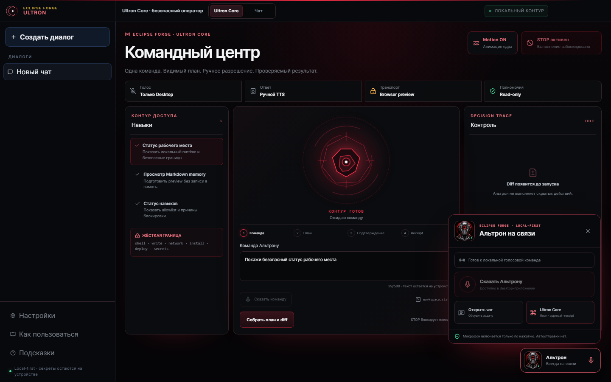
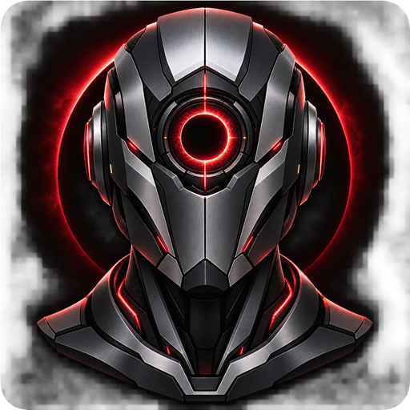
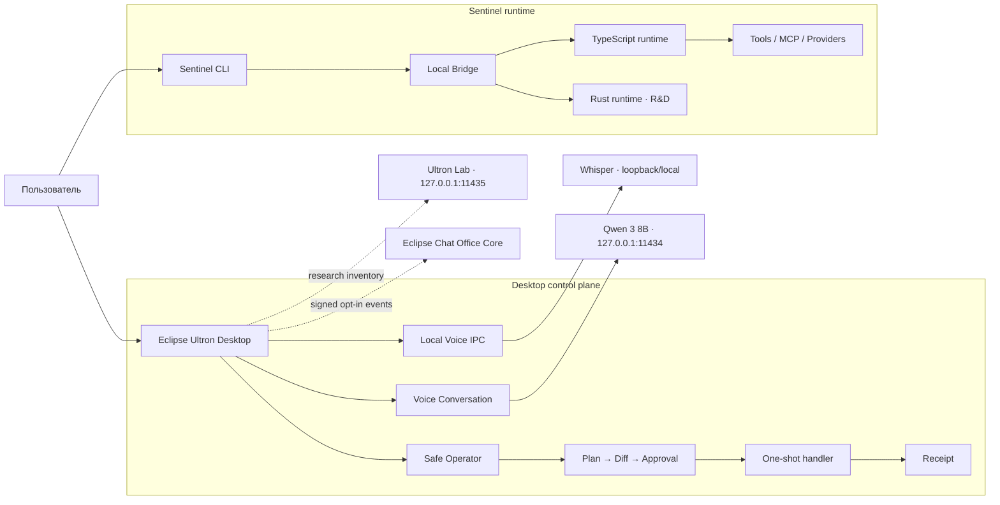

<div align="center">



# Eclipse Ultron

### Локальный AI command center: голос → план → approval → действие → receipt

[](https://github.com/PavelHopson/eclipse-hopson-sentinel/actions/workflows/ci.yml)


**Eclipse Ultron** — пользовательское desktop-приложение Eclipse Forge.<br/>
**Sentinel** — его совместимый runtime, CLI, IPC и набор инженерных контрактов.

[Возможности](#что-уже-работает) · [Архитектура](#архитектура) · [Быстрый старт](#быстрый-старт) · [Голос](#голосовая-связь) · [Безопасность](#модель-безопасности) · [Документация](#документация)

</div>

---

## Зачем существует Ultron

Большинство AI-интерфейсов скрывает слишком много: где обрабатываются данные, что именно
собирается выполнить агент и как проверить результат. Eclipse Ultron строится вокруг другой
модели взаимодействия:

1. пользователь явно формулирует или произносит команду;
2. Ultron показывает план и ожидаемый diff;
3. человек подтверждает ограниченное действие;
4. runtime выполняет один разрешённый handler;
5. интерфейс возвращает проверяемый receipt.

Это не обещание автономного «управления всем компьютером». Текущий desktop-контур намеренно
ограничен read-only навыками, ручным approval и локальным STOP.

## Что уже работает

| Поверхность | Что даёт | Текущая граница |
| --- | --- | --- |
| **Альтрон** | центральный живой voice-first диалог: one-shot STT, быстрый локальный ответ и TTS | без текстового composer; одна реплика на один явный клик |
| **Operator** | command room с plan, diff, approval и receipt | execute требует отдельного approval и снятия STOP |
| **Ultron Lab** | изолированный инвентарь 27B research-моделей | не участвует в живом голосе; без tools, shell, filesystem, network и execute |
| **Sentinel CLI** | coding-agent, provider routing, bridge и MCP contracts | расширенные права зависят от явной конфигурации |
| **Office bridge** | подписанные локальные события для Eclipse Chat | opt-in, bounded payloads, replay protection |
| **Windows Doctor** | read-only security posture audit | диагностика без автоматического remediation |

<p align="center">
  
</p>

## Голосовая связь

<table>
  <tr>
    <td width="170" align="center">
      
    </td>
    <td>
      <strong>Альтрон — основной экран, а не дополнение к текстовому чату.</strong><br/><br/>
      Нажатие «Говорить с Альтроном» распознаёт одну фразу, отправляет её только в
      закреплённый быстрый Qwen 3 8B и озвучивает ответ. Последняя реплика и ответ видны
      для проверки. Микрофон никогда не запускается автоматически.
    </td>
  </tr>
</table>

Локальный voice pipeline:

```text
explicit click
    └─> trusted Electron IPC (без renderer-параметров)
          └─> whisper.cpp + large-v3-turbo-q5_0
                └─> transcript in memory
                      └─> fixed Qwen 3 8B → visible answer → bounded TTS

Operator: explicit dictation → editable command → plan → diff → approval → receipt
```

- один STT process одновременно;
- USB-микрофоны открываются через локальный SDL DirectSound backend с согласованием `16 kHz / mono`;
- фиксированный timeout и rate limit;
- bounded JSON output;
- аудио и транскрипт не сохраняются;
- визуальные состояния `listening / thinking / speaking / success / error` синхронизированы с turn;
- TTS ограничен 500 символами и 45 секундами, голос можно остановить вручную;
- wake word и background listening выключены.

Подробности: [Eclipse Ultron Local AI Runtime](docs/ultron-local-ai-runtime.md).

## Архитектура



### Принцип разделения

- **Ultron** отвечает за понятный desktop UX и видимые состояния.
- **Sentinel** сохраняет стабильные CLI, storage и IPC-контракты.
- **Policy Gate** определяет полномочия; модель не может расширить их текстовым ответом.
- **Local AI Runtime** хранится отдельно от Git и installer: бинарники и веса не попадают в репозиторий.

## Модель безопасности

| Контроль | Реализация |
| --- | --- |
| Human approval | execute недоступен до preview плана и явного подтверждения |
| One-shot permission | approval сгорает после одного результата |
| Kill switch | STOP включён по умолчанию и блокирует execute |
| Voice privacy | только явный one-shot capture; без background recording |
| Renderer boundary | fixed IPC channel, zero user-controlled process arguments |
| Process safety | `spawn`, `shell: false`, timeout, output limit, one in-flight process |
| Local endpoints | Ollama profiles слушают только loopback |
| Lab isolation | abliterated model получает chat completion, но не tools |
| Office transport | bounded signed events, nonce/replay protection, explicit opt-in |
| Browser boundary | read-only worker требует отдельной изоляции и allowlist |

> Ответ любой модели считается недоверенным текстом. Наличие локальной модели не превращает
> её в policy engine и не даёт прав на shell, secrets, install, deploy или изменение файлов.

## Локальные модели: честный профиль

| Профиль | Endpoint | Назначение | Default |
| --- | --- | --- | --- |
| `qwen3:8b` | `127.0.0.1:11434` | живой голосовой диалог | да, закреплён |
| `huihui_ai/qwen3.8-abliterated:27b` | `127.0.0.1:11435` | изолированный Lab-эксперимент | нет |
| OrcaRouter Qwen3.8 27B Q4 | `127.0.0.1:11435` | установленный Lab-кандидат; сравнительный benchmark ожидается | нет |

Измерение 27B Q4_K_M на RTX 4060 Ti 16 GiB / 64 GiB RAM, `num_ctx=8192`, `think=false`:

| Режим | Load | Generation | Total |
| --- | ---: | ---: | ---: |
| cold start | 233.3 s | 8.2 tok/s | 254.56 s |
| warm request | 0 s | 6.98 tok/s | 5.07 s |

Практический вывод: 27B работает, но почти четырёхминутный cold start исключает её из
default-профиля. Она остаётся opt-in Lab-моделью без инструментов; для повседневного диалога
разумнее `qwen3:8b`.

## Быстрый старт

### Desktop development

Требования: Windows 10/11, Node.js 20+, npm. Для локального голоса нужен отдельно
подготовленный [Eclipse AI Runtime](docs/ultron-local-ai-runtime.md).

```powershell
cd dashboard
npm ci
npm run dev
```

Electron development:

```powershell
cd dashboard
npm run electron:dev
```

Production build и локальный NSIS installer:

```powershell
cd dashboard
npm run electron:build
```

Готовый файл появляется в `dashboard/release/`. Текущий installer предназначен для
внутреннего тестирования: публичное распространение заблокировано до code signing и
provenance review.

### Sentinel Core

Требования: Bun 1.3.12+, Node.js 20+.

```powershell
bun install --frozen-lockfile
bun run build
node .\bin\sentinel --version
```

Диагностика среды:

```powershell
bun run doctor:runtime
bun run doctor:windows
```

## Проверки качества

Desktop:

```powershell
cd dashboard
npm run lint
npm run build
npm audit
```

Focused security/UX contracts:

```powershell
node --test scripts/dashboard-security.test.mjs
node --test scripts/dashboard-operator-security.test.mjs
node --test scripts/dashboard-ultron-security.contract.mjs
node --test scripts/dashboard-branding.contract.mjs
node --test scripts/dashboard-usage-guide.contract.mjs
```

Runtime:

```powershell
bun test
bun run typecheck:supported
bun run typecheck:debt
bun run smoke
```

CI выполняет Bun build/tests, supported-contract typecheck, inherited-debt guard, Python
provider tests и Windows Doctor self-test.

## Структура репозитория

```text
eclipse-hopson-sentinel/
├── dashboard/              # Eclipse Ultron · React + Electron + NSIS
│   ├── electron/           # trusted main/preload и Safe Operator IPC
│   ├── src/                # Voice Conversation, Operator, Settings
│   └── public/brand/       # first-party Ultron visual assets
├── src/                    # Sentinel TypeScript runtime
├── rust/                   # next-generation runtime track
├── bin/                    # sentinel / voice / operator entrypoints
├── office/                 # Eclipse Chat Office event bridge
├── scripts/                # doctors, security gates, build and voice adapters
└── docs/                   # contracts, ADR, setup, roadmap and engineering log
```

## Документация

| Раздел | Документ |
| --- | --- |
| Первый запуск | [Windows quick start](docs/quick-start-windows.md) |
| Установщик | [Windows installer](docs/windows-installer.md) |
| Локальный голос и модели | [Ultron Local AI Runtime](docs/ultron-local-ai-runtime.md) |
| Реестр и evidence моделей | [Ultron model registry](docs/ultron-model-registry.md) |
| Safe Operator | [Operator contract](docs/sentinel-safe-operator.md) |
| Voice architecture | [Voice plan](docs/sentinel-voice-plan.md) |
| Bridge API | [Sentinel Bridge](docs/sentinel-bridge.md) |
| Office Core | [Office bridge](docs/sentinel-office-bridge.md) |
| Конфигурация | [Config Health](docs/sentinel-config-health.md) |
| Диагностика Windows | [Windows Doctor](docs/sentinel-windows-doctor.md) |
| Архитектурные решения | [Hybrid architecture](docs/hybrid-architecture.md) |
| План развития | [Sentinel roadmap](docs/sentinel-roadmap.md) |
| Изменения | [Engineering log](docs/sentinel-engineering-log.md) |

## Ближайший roadmap

- signed Windows releases и проверяемые update artifacts;
- cancellable voice session и явный retry без фонового listening;
- компактный always-on-top contact mode;
- локальная инвентаризация моделей с безопасным выбором default;
- новые capabilities только как отдельные least-privilege contracts с preview и rollback;
- production credential lifecycle для opt-in Eclipse Chat Office bridge.

Актуальный источник истины: [docs/sentinel-roadmap.md](docs/sentinel-roadmap.md).

## Статус и происхождение

Проект находится в активной разработке и пока не является публичным массовым дистрибутивом.
Desktop-приложение и Eclipse-контракты развиваются как first-party слой, но исходный CLI-код
имеет смешанное происхождение. До фиксации точных upstream SHA и юридической проверки:

- npm package остаётся `private`;
- публичная публикация и продажа дистрибутива запрещены;
- unsigned installer используется только локально;
- условия определяются [LICENSE](LICENSE) и [THIRD_PARTY_NOTICES.md](THIRD_PARTY_NOTICES.md).

Security issues следует сообщать по процедуре из [SECURITY.md](SECURITY.md), не через
публичный issue с чувствительными деталями.

---

<div align="center">

**Eclipse Forge · инженерные системы, в которых действие видно до выполнения**

</div>
