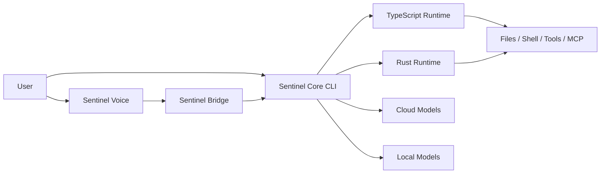

# Eclipse Hopson Sentinel

> Локальный AI-оператор нового поколения для кода, терминала, автоматизации и голосового взаимодействия.

`Eclipse Hopson Sentinel` — это не просто CLI для работы с моделями.  
Это фундамент для личной операторской системы: локальной, расширяемой, ориентированной на код, voice-интерфейсы и безопасную автоматизацию.

## Почему Sentinel

`Sentinel` создаётся как практический AI-центр для разработчика и power-user:

- работает как coding-agent для проектов и репозиториев
- умеет жить в терминале, а не только в браузере
- строится вокруг локального control flow, а не только облачного UX
- получает собственный voice-layer, diagnostics, backup discipline и installer flow
- объединяет рабочий TypeScript runtime и развивающийся Rust runtime

Если коротко, `Sentinel` — это шаг от “CLI к модели” к “локальному цифровому оператору”.

## Что уже есть

### Sentinel Core

- TypeScript/Bun runtime для coding-agent сценариев
- работа с кодом, файлами, shell и инструментами
- bridge API для внешних клиентов
- совместимость с OpenAI-compatible провайдерами и локальными моделями

### Sentinel Voice

- отдельный voice client через `sentinel-voice`
- безопасный локальный оператор через `sentinel-operator`: детерминированный план, ручное подтверждение, один read-only запуск и проверяемый receipt
- локальный TTS на Windows
- one-shot STT
- terminal-safe push-to-talk
- voice doctor для диагностики среды

### Operator foundation

- persistent bridge sessions
- deterministic config health audit
- локальные snapshot backups
- restore flow для ключевых Sentinel surfaces
- первый Windows installer flow с `DryRun`

## Для кого этот проект

- для разработчиков, которым нужен локальный AI-ассистент для кода
- для тех, кто хочет собрать собственный аналог Claude Code / Jarvis-style operator
- для power-user, которым нужен voice + terminal + automation stack
- для тех, кто хочет контролировать стек, а не только пользоваться чужим SaaS UI

## Ключевые сценарии

### 1. Coding agent

`Sentinel` может быть базой для повседневной работы с проектами:

- разбор репозиториев
- работа с файлами и shell
- маршрутизация в облачные и локальные модели
- build/debug/operator workflow из терминала

### 2. Voice operator

`Sentinel Voice` — это ранний, но уже реальный шаг к локальному голосовому ассистенту:

- озвучивание ответов
- голосовой ввод
- push-to-talk режим
- подготовка к desktop shell и wake-word архитектуре

### 3. Safe local automation

`Sentinel` постепенно получает не только agent-функции, но и инженерную дисциплину:

- backup перед изменениями
- config health scoring
- voice diagnostics
- read-only Windows security posture audit
- session persistence

## Архитектура



## Текущая структура платформы

| Слой | Назначение | Статус |
| --- | --- | --- |
| `Sentinel Core` | основной coding-agent runtime | рабочая база |
| `Sentinel Bridge` | localhost API для voice и desktop клиентов | уже используется |
| `Sentinel Voice` | voice client, TTS, STT, PTT | MVP |
| `Rust Runtime` | next-generation engine | в развитии |
| `Config Health / Backups` | reliability и operator safety | уже встроены |

## Быстрый старт

### Вариант 1. Установщик для Windows

Из локальной копии репозитория:

```powershell
powershell -ExecutionPolicy Bypass -File .\scripts\install-sentinel-windows.ps1 -DryRun
powershell -ExecutionPolicy Bypass -File .\scripts\install-sentinel-windows.ps1
```

### Вариант 2. Запуск из репозитория

```powershell
bun install
bun run build
node .\bin\sentinel
```

### Вариант 3. Голосовой клиент

```powershell
node .\bin\sentinel-voice --list-voices
node .\bin\sentinel-voice --stt --ptt --speak --voice Russian
```

## Настройка моделей

### OpenAI-compatible

```powershell
$env:CLAUDE_CODE_USE_OPENAI="1"
$env:OPENAI_API_KEY="sk-your-key-here"
$env:OPENAI_MODEL="gpt-4o"
sentinel
```

### Ollama

```powershell
$env:CLAUDE_CODE_USE_OPENAI=”1”
$env:OPENAI_BASE_URL=”http://localhost:11434/v1”
$env:OPENAI_MODEL=”qwen2.5-coder:7b”
sentinel
```

### ClawRouter (авто-роутинг 55+ моделей)

```powershell
# npx @blockrun/clawrouter  ← запустить отдельно
$env:CLAUDE_CODE_USE_OPENAI=”1”
$env:OPENAI_BASE_URL=”http://localhost:8402/v1”
$env:OPENAI_API_KEY=”x402”
$env:OPENAI_MODEL=”blockrun/auto”
sentinel
```

### MetaClaw (авто-скиллы из сессий)

```powershell
# metaclaw start  ← запустить отдельно
$env:CLAUDE_CODE_USE_OPENAI=”1”
$env:OPENAI_BASE_URL=”http://127.0.0.1:30000/v1”
$env:OPENAI_API_KEY=”metaclaw”
$env:OPENAI_MODEL=”your-model-id”
sentinel
```

> Подробнее обо всех интеграциях: [docs/sentinel-integrations.md](docs/sentinel-integrations.md)

### Безопасные MCP-пресеты

Sentinel умеет добавить три проверенных MCP-интеграции с ограниченными настройками по умолчанию:

```powershell
# Документация библиотек. Работает без ключа; ключ можно настроить отдельно для повышенных лимитов.
sentinel mcp add-preset context7 --scope project

# Доступ только к одной указанной папке. Не передавайте домашнюю папку или весь диск.
sentinel mcp add-preset filesystem --path . --scope project

# Только чтение GitHub. Токен не записывается в конфиг.
$env:GITHUB_PERSONAL_ACCESS_TOKEN="github_pat_your_fine_grained_token"
sentinel mcp add-preset github-readonly --scope project

sentinel mcp doctor --config-only
```

Все presets закрепляют версии, GitHub запускается в read-only + lockdown режиме, а Filesystem требует
одну существующую allowed directory. Перед первым использованием проверьте список и описания tools:
MCP metadata считается недоверенным вводом даже для официального сервера.

### Изолированный browser read worker

`BrowserRead` появляется в списке tools только при полной fail-closed конфигурации. Обычный
`WebFetch` остаётся первым способом чтения; browser нужен лишь для публичной JS-heavy страницы.
Sentinel не устанавливает Camofox и не запускает его на основной машине.

Обязательная граница запуска:

```powershell
$env:SENTINEL_CAMOFOX_ISOLATED="true"              # отдельный container/VM без workspace и secrets
$env:CAMOFOX_CRASH_REPORT_ENABLED="false"         # telemetry off в worker
$env:SENTINEL_CAMOFOX_PERSISTENCE_DISABLED="true" # persistence plugin disabled in camofox.config.json
$env:CAMOFOX_ACCESS_KEY="32+ random characters"
$env:SENTINEL_CAMOFOX_ENDPOINT="http://127.0.0.1:9377"
$env:SENTINEL_BROWSER_ALLOWED_DOMAINS="docs.example.com,example.com"
sentinel
```

До запуска удалите/выключите upstream persistence plugin в `camofox.config.json`: attestation env
не меняет конфиг автоматически, а заставляет оператора подтвердить эту границу. Tool создаёт
одноразовую вкладку, читает accessibility snapshot и закрывает session. Он не
экспонирует click, type, cookie import, downloads, payment, publish или account changes.
Все URL до и после navigation проходят allowlist, а содержимое страницы возвращается с явной
меткой `UNTRUSTED WEB CONTENT`. DNS/public-only egress всё равно должен ограничиваться на уровне
контейнера: application allowlist не заменяет network sandbox.

## Почему это сильнее обычного “ещё одного AI CLI”

- у проекта есть не только runtime, но и operator-архитектура
- voice-stack развивается как часть системы, а не как отдельная игрушка
- bridge, diagnostics, backups и installer уже закладывают product discipline
- проект строится как самостоятельный бренд `Eclipse Hopson`, а не как временный форк

## Документация

- [Расширенная настройка](docs/advanced-setup.md)
- [Быстрый старт для Windows](docs/quick-start-windows.md)
- [Быстрый старт для macOS / Linux](docs/quick-start-mac-linux.md)
- [Гибридная архитектура](docs/hybrid-architecture.md)
- [Установщик для Windows](docs/windows-installer.md)
- [Sentinel Bridge API](docs/sentinel-bridge.md)
- [Sentinel Voice MVP](docs/sentinel-voice-mvp.md)
- [Sentinel Safe Operator](docs/sentinel-safe-operator.md)
- [Sentinel Config Health](docs/sentinel-config-health.md)
- [Sentinel Windows Doctor](docs/sentinel-windows-doctor.md)
- [Kimi K3 benchmark track](docs/sentinel-kimi-k3-benchmark.md)
- [Sentinel Backups](docs/sentinel-backups.md)
- [Инженерный журнал](docs/sentinel-engineering-log.md)
- [Master Roadmap Sentinel](docs/sentinel-roadmap.md)
- [План голосовой архитектуры](docs/sentinel-voice-plan.md)

## Зрелость проекта

Сейчас `Sentinel` уже выглядит как сильная инженерная база, но ещё не как полностью отполированный массовый продукт.

Что уже хорошо:

- сильная core-основа
- voice MVP
- safety/disciplined tooling
- собственный installer flow

Что ещё развивается:

- полный green-path installer
- continuous voice mode
- wake word
- desktop shell
- build hardening и release hardening

## Стратегическое направление

Следующий уровень для `Eclipse Hopson Sentinel`:

- довести установку до “установил и пользуешься”
- сделать desktop presence
- укрепить voice interaction
- развить operator workflows
- постепенно довести систему до уровня полноценного локального цифрового оператора

## Важно

- переменные `CLAUDE_CODE_*` пока сохранены для совместимости с унаследованным runtime
- часть внутренних имен из прежних upstream-слоёв всё ещё сохраняется для стабильности
- для полного локального build/install сейчас по-прежнему нужен `Bun`

## Лицензия

Репозиторий пока не готов к публичному распространению как MIT-пакет.
Собственные изменения Eclipse Hopson доступны на условиях MIT только там,
где это не конфликтует с правами на импортированные компоненты. Базовый
CLI-слой имеет неразрешённое смешанное происхождение; npm publish отключён
до фиксации точных upstream commit SHA и юридической проверки.

Подробности: [LICENSE](LICENSE) и
[THIRD_PARTY_NOTICES.md](THIRD_PARTY_NOTICES.md).
## Offline Spec Gate verification

Sentinel can verify an approved eclipse.spec-gate.v1 artifact without network access or command execution.

Command: sentinel spec verify --spec PATH_TO_SPEC_JSON --workspace PATH_TO_REPOSITORY

Add --json to receive the machine-readable eclipse.spec-verification.v1 report. The verifier
rejects policy escalation, stage drift, path traversal, .git access, symlinks and missing evidence.
It only hashes local evidence files. A PASS confirms artifact shape and evidence presence; it does
not prove behavior and does not authorize implementation, shell, GitHub or deployment.

## Eclipse Forge visual contract

Sentinel uses the local `eclipse-forge.visual-system.v1` snapshot in the `operational` profile. Its TUI maps the shared signal-blue, warm-gold, text, muted and status colors without adding animation loops or weakening terminal readability.


## Dependency hardening — 2026-08-13

- Updated the command parser, network, WebSocket, MCP, Anthropic SDK and Firecrawl dependency surfaces to fixed releases.
- Added explicit transitive overrides for gRPC, Hono, URL/XML parsing, protobuf and UUID packages where upstream ranges otherwise retained known Critical/High advisories.
- Provider SDKs and the OpenTelemetry stack are version-aligned, and the post-remediation Bun audit reports zero advisories.
- Dependency lifecycle scripts remain blocked by Bun; no newly downloaded install script was trusted or executed.
- Build, CLI smoke, distribution guard, Windows Doctor, all 216 Bun tests and all 44 Python provider tests pass. CI strictly typechecks maintained Eclipse contracts and rejects growth beyond the documented platform-specific inherited full-program baseline (3,995 diagnostics on Windows; 4,291 on Linux CI).

The dashboard now declares the same `operational` profile explicitly: flat task surfaces, a single signal line and color-only interaction feedback. Production build passes; no scanning, provider, secret or authorization behavior changed.
