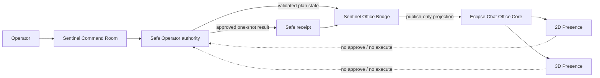

# Sentinel Office Bridge and Presence Boundary

Status: bounded v1 contract, safe lifecycle, canonical Eclipse Chat adapter, signed HTTP ingest, Windows Credential Manager boundary, explicit opt-in Electron main-process composition and durable Office Core replay are locally implemented and tested as of 2026-08-23. Publication is disabled by default; production credential provisioning and rotation remain deliberately unconfigured.

> Compatibility boundary: `eclipse.office.event.v1` below is Sentinel's internal projection
> envelope, not the canonical Eclipse Chat `office.event.v1` wire event. Use
> `office/eclipse-chat-office-adapter.mjs` and
> `docs/sentinel-eclipse-chat-contract-sync.md` at the Office Core boundary.

## Authority model

Sentinel remains the sole source of execution authority. Office Core, 2D Presence, and 3D Presence receive a lossy operational projection only.



The dotted paths do not exist as capabilities. A visual client cannot approve a plan, release STOP, execute a skill, or manufacture a Sentinel receipt.

## Implemented files

- Runtime contract and reference channel: `office/sentinel-office-bridge.mjs`
- Non-blocking Safe Operator lifecycle and bounded outbox: `office/sentinel-office-lifecycle.mjs`
- Eclipse Chat compatibility adapter: `office/eclipse-chat-office-adapter.mjs`
- Signed atomic ingest client: `office/eclipse-chat-office-ingest-client.mjs`
- Contract sync and transport boundary: `docs/sentinel-eclipse-chat-contract-sync.md`
- HTTP ingest contract: `docs/contracts/eclipse-chat-office-ingest-v1.md`
- Machine-readable contracts: `docs/contracts/sentinel-office-event-v1.schema.json` and
  `docs/contracts/eclipse-chat-office-event-v1.schema.json`
- Security and integration tests: `scripts/sentinel-office-bridge.test.mjs` and related Office suites
- Local staged credential rotation: `office/office-credential-rotation.mjs`
- Zero-downtime operator runbook: `docs/sentinel-office-credential-rotation.md`

`createSentinelOfficeBridge({ publish })` receives only a publish function. `createInMemoryOfficeProjectionChannel()` returns two deliberately separate ports:

- `sentinelPublisher.publish(event)` — pass only to Sentinel composition code;
- `presenceSubscriber.subscribe(...)` and `.snapshot(...)` — pass only to Office/Presence consumers.

The subscriber port has no `publish`, `approve`, or `execute` method. Consumer exceptions and transport failures cannot interrupt or roll back the Sentinel authority result.

## Event envelope

Every event uses `eclipse.office.event.v1` and exact keys:

```json
{
  "schemaVersion": "eclipse.office.event.v1",
  "eventId": "uuid",
  "streamId": "uuid",
  "sequence": 1,
  "type": "sentinel.presence.snapshot.v1",
  "source": "eclipse-hopson-sentinel",
  "subject": "agent:sentinel",
  "time": "2026-08-23T12:00:00.000Z",
  "correlationId": null,
  "audience": [
    "eclipse-chat.office-core",
    "eclipse-chat.presence-2d",
    "eclipse-chat.presence-3d"
  ],
  "data": {
    "mode": "idle",
    "availability": "available",
    "attention": "none",
    "activePlanId": null,
    "activeSkillId": null
  }
}
```

Unknown envelope or payload fields fail closed. Events are capped at 16 KiB, sequence is monotonic within a stream, and `eventId` is replay-protected.

## Event types required by Eclipse Chat

| Event type | Office meaning | Delivery policy |
|---|---|---|
| `sentinel.presence.snapshot.v1` | Current visual state: idle, planning, awaiting approval, executing, speaking, blocked, or offline | Coalescible; keep latest per Sentinel subject |
| `sentinel.operator.plan-projected.v1` | A safe plan exists and still requires approval; STOP is engaged | Ordered, non-coalescible |
| `sentinel.operator.execution-projected.v1` | Sentinel authority accepted an already approved one-shot request | Ordered, non-coalescible |
| `sentinel.operator.receipt-projected.v1` | Bounded execution receipt metadata | Ordered, non-coalescible |
| `sentinel.operator.blocked.v1` | Public failure class without internal error text | Ordered, non-coalescible |
| `sentinel.safety.boundary.v1` | Authority and denied-effects snapshot | Retain latest and replay to new subscribers |

The execution projection may be published only after the Safe Operator has validated the exact request, approval TTL, STOP release, replay guard, and rate limit. Calling `projectExecutionAccepted()` never performs an action; it only mirrors an authority decision that already happened.

## Data that must never enter the Office Event Bus

- raw user command or prompt;
- model input/output or chain-of-thought;
- receipt `summary`, `speech`, or `lines`;
- memory preview content;
- filesystem paths, hostname, environment variables, logs, or stack traces;
- API keys, cookies, authorization headers, access/refresh tokens, or provider credentials;
- arbitrary error messages;
- approval payloads or STOP-release controls.

The bridge builds every projection field-by-field and rejects sensitive field names. It never spreads a plan or receipt into an event.

## IPC and authentication requirements for Eclipse Chat

Office Core must enforce these requirements at the transport boundary:

1. On Windows, prefer a named pipe with an explicit user/service ACL. A loopback WebSocket or gRPC endpoint is acceptable when a named pipe is unavailable. Never bind the default development endpoint to `0.0.0.0`.
2. A non-loopback deployment requires mutual TLS and explicit device enrollment. TLS without producer authentication is insufficient.
3. Authenticate the connection before accepting a subscription. Bind the authenticated service identity to one of:
   - `eclipse-chat.office-core`;
   - `eclipse-chat.presence-2d`;
   - `eclipse-chat.presence-3d`.
4. Credentials belong only in the transport handshake or `Authorization` metadata. Never place them in an event, query string, renderer state, localStorage, analytics, or logs.
5. Use short-lived service credentials with a maximum five-minute TTL and audience `eclipse-office-bus`. Store renewable credentials through Windows DPAPI/Credential Manager, not repository files or `.env` committed to Git.
6. Enforce topic ACL server-side. Only the authenticated `eclipse-hopson-sentinel` producer may publish `sentinel.*`; Presence identities are subscribe-only. The envelope `source` must match the authenticated producer identity.
7. Accept only the six exact v1 event types. Do not use a wildcard deserializer or silently retain unknown fields.
8. Cap a connection at 30 Sentinel events per second and each event at 16 KiB. Excess traffic is dropped or quarantined without affecting Sentinel execution.
9. Reject timestamps more than five seconds in the future or older than five minutes. Retain `eventId` deduplication for at least that replay window and require increasing `sequence` per `streamId`.
10. Do not return transport errors, subscriber errors, or rendering errors into the Safe Operator result path. Projection availability is informative, never authoritative.

For WebSocket transport, the authenticated Office Core connection should subscribe once and fan out internally. 2D/3D renderers should not receive the bus credential or open their own privileged socket from an untrusted renderer process.

The signed HTTP ingest producer is a separate boundary from renderer subscriptions. It uses the
five `x-office-*` headers and exact HMAC contract in
`docs/contracts/eclipse-chat-office-ingest-v1.md`; it never places credentials in event metadata or
exposes the signing secret to 2D/3D renderers.

## 2D and 3D projection mapping

Recommended mapping is deterministic and contains no model-generated animation instruction:

| Presence mode | 2D/3D representation |
|---|---|
| `idle` | At workstation, neutral animation |
| `planning` | Thinking indicator |
| `awaiting-approval` | Attention marker; clicking opens Command Room but does not approve |
| `executing` | Busy animation with read-only badge |
| `speaking` | Local speaking animation only |
| `blocked` | Policy-blocked state with a link back to Command Room |
| `offline` | Desaturated/offline representation |

Presence animation is presentation state. It must not infer permissions from color, animation, proximity, clicks, or avatar state.

## Integration sequence for Eclipse Chat Office Core

1. Import or mirror `sentinel-office-event-v1.schema.json` with `additionalProperties: false` preserved.
2. Implement the authenticated publish adapter expected by `createSentinelOfficeBridge({ publish })`.
3. Validate producer identity, envelope, event type, timestamp, size, replay ID, and stream sequence before fan-out.
4. Persist only the projected envelope when audit history is required. Never request the omitted command or receipt content to enrich the visual scene.
5. Coalesce Presence snapshots but preserve operator plan/execution/receipt/blocked ordering by `streamId` and `sequence`.
6. Expose a read-only Office Core projection API to 2D/3D renderers.
7. Keep future command submission on a separate authenticated Sentinel Command Gateway. That gateway must create a normal Safe Operator plan and return control to the existing manual approval/receipt path.

## Verification

```powershell
bun test scripts\sentinel-office-bridge.test.mjs
```

The test suite verifies data minimization, immutable projections, producer/subscriber ACL, mass-assignment rejection, replay and ordering checks, bounded rate, and projection failure isolation.
